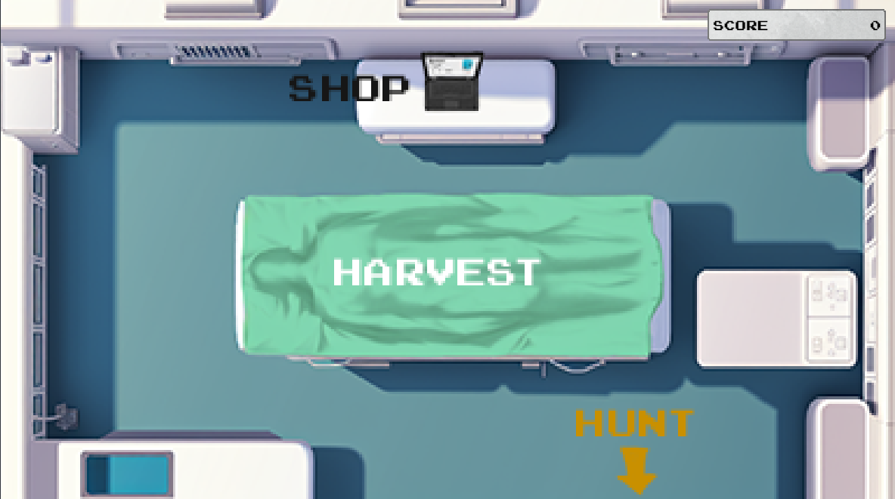
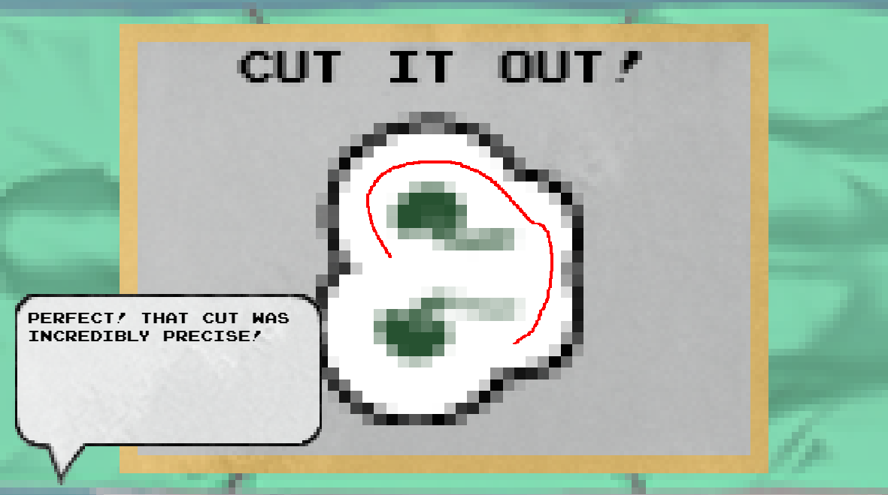
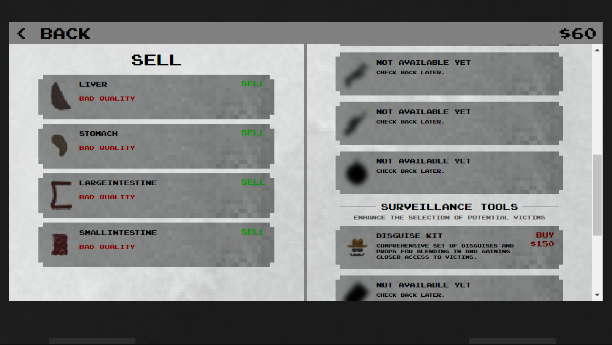

# De-Liver
De-Liver is an organ harvesting game built during for [Ludum Dare 53](https://ldjam.com/events/ludum-dare/53). The goal of the game is to "collect" people, "borrow" their organs, and then sell them on the "market". 

Show your skill when extracting the organs, or use your money to buy a serious number of upgrades. Oh, and watch out for secret endings!

### Technologies

The game is built using React, Redux, and styled-components.
